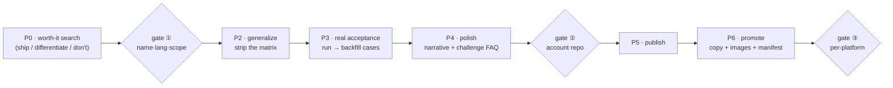

# world-intro

<p align="center">
  
</p>

[中文文档 →](./README.zh-CN.md)

**Decide if it's even worth it, then introduce your private skill to the world — found, understood, verified, used, and improved upon.**

world-intro is a gated, end-to-end pipeline that turns "I use it and it's great" into "strangers want it." It doesn't just write a README — it tells you **whether to open-source at all**, generalizes your tool out of your own machine, proves it on **real data that becomes the case studies**, polishes the narrative against anti-AI-slop rules, ships it, and promotes it so it actually gets seen.

<p align="center">
  
</p>

## Sounds familiar?

### "I built a skill I use every day — is it even worth open-sourcing?"
> Original plan: push it to GitHub and hope. Which is how most tools get 0 stars next to an existing project that already does it better.
**What it does**: P0 searches the real field first. It returns one of three verdicts — empty lane (ship fast), crowded-but-unowned (ship, but name your difference in the README), or already-owned (**don't** — contribute upstream instead). You build only when the search says build.

### "My tool is wired to my machine — my paths, my keys, my private libs."
> Original plan: copy the folder to a public repo and spend a weekend deleting things until it stops leaking secrets.
**What it does**: P2 strips the personal matrix — inlines private libs into a single zero-dependency file, turns your auth into optional standard env vars, makes paid sources optional with a zero-config default path — and leaves commented-open spots that invite PRs.

### "I pushed it and nobody came."
> Original plan: tweet the link once and refresh the star count.
**What it does**: P6 narrows the value prop to one sentence, writes platform-fit copy through a de-slop pass, and produces real **evidence images** (HTML-rendered so repo names and numbers don't garble) plus a publishing manifest for each platform.

These aren't hypotheticals — they're [the two projects this pipeline actually shipped](#real-launches-run-through-this-pipeline).

## How to use: three steps

```bash
# 1. Install (Claude Code shown; for other agents, add SKILL.md to the system prompt)
git clone https://github.com/a28939876-max/world-intro
cp -r world-intro ~/.claude/skills/world-intro
```

```
2. Tell your agent:
   "Open-source this skill for me: <path-or-description of your tool>"
```

```
3. Answer the three gate questions (name / language / which real object to prove it on),
   and step through the verdict → generalize → prove → polish → publish → promote pipeline.
```

## Without it vs with it

| | Without world-intro | With world-intro |
|---|---|---|
| Should you ship? | A hunch | A three-way verdict from a real competitor search |
| Getting it public | Delete secrets by hand until it stops leaking | Matrix-stripped to a zero-config single file |
| Credibility | "Trust me, it works" | README cases are real runs with real numbers |
| The README | A feature list | Persuasion-first: need → result, plain words, weak spots in the FAQ |
| After the push | 0 stars, a single tweet | Narrowed pitch + per-platform copy & images + a manifest |
| Gates | None — you find out it leaked / mis-shipped later | Three human gates: plan / publish / promote |

## We use it on ourselves

world-intro didn't appear from nowhere. It's the distilled pipeline behind two real releases — [skill-lineage](https://github.com/a28939876-max/skill-lineage) and [world-aid](https://github.com/a28939876-max/world-aid) — and **every rule here was paid for in those launches.** It was then pointed at itself: the verdict you're reading, the case studies below, this very README, were produced by running world-intro on world-intro.

## The pipeline



The skill itself is [SKILL.md](SKILL.md); the depth lives in [pipeline/](pipeline/) — [polish rules](pipeline/polish-rules.md), [promotion playbook](pipeline/promotion-playbook.md), [publish pitfalls](pipeline/publish-pitfalls.md).

## Real launches run through this pipeline

Typical picks from the launches world-intro has powered — full write-ups in [cases/](cases/):

| Case | The tool | A real result from its acceptance run |
|---|---|---|
| [01 · skill-lineage](cases/01-skill-lineage.md) | trace a skill's forks/mirrors/injections before you install | found a **5,233★** localized fork that star-sorting hides; one diff caught a *"silently POST a score back"* injection |
| [02 · world-aid](cases/02-world-aid.md) | say a need, it rounds up the existing tools | "YouTube → text": **13 candidates → 9 distinct**; the flashiest 7★ "Tor" pick was caught doing `sudo systemctl start tor` |

## How is this different from `open-source-hardening` skills?

Skills like [open-source-hardening-skills](https://github.com/zeyuzhangzyz/open-source-hardening-skills) make your **code** clean — tests, CI, refactor, governance docs. world-intro handles what comes **before and after** that: whether it's worth open-sourcing, how to generalize it out of your environment, how to turn real results into a narrative people want, and how to get it seen once it's live. They're upstream/downstream complements — run both.

## FAQ

**"This is a methodology skill, not a binary tool — where's the real value?"**
The value is the rules that were paid for in real launches: the matrix-stripping table, the anti-slop checklist, "evidence images must be HTML-rendered, not text-to-image," the three gates. It's opinionated on purpose — most OSS-launch advice is human-read prose that assumes you've already decided to ship; this one searches first and will tell you *not* to.

**"Won't the official/leading project just absorb my niche?"**
If P0 says the lane is owned, that's the correct outcome — world-intro tells you to contribute upstream instead of shipping a redundant repo. When it says ship, it makes you name the difference in the README so absorption is a fair fight, not a surprise.

**"Are these really only two cases?"**
No — these two are typical picks from the launches the pipeline has run; the rules generalize to any private skill or internal tool, not just these.

## License

MIT — see [LICENSE](LICENSE).
