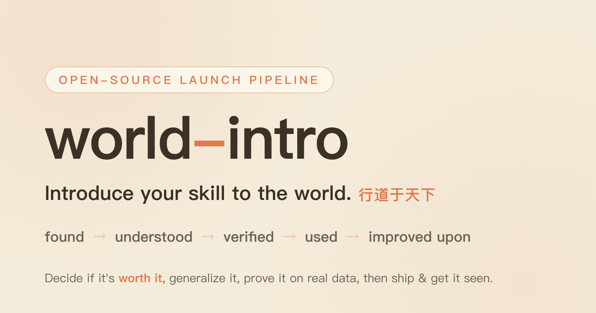
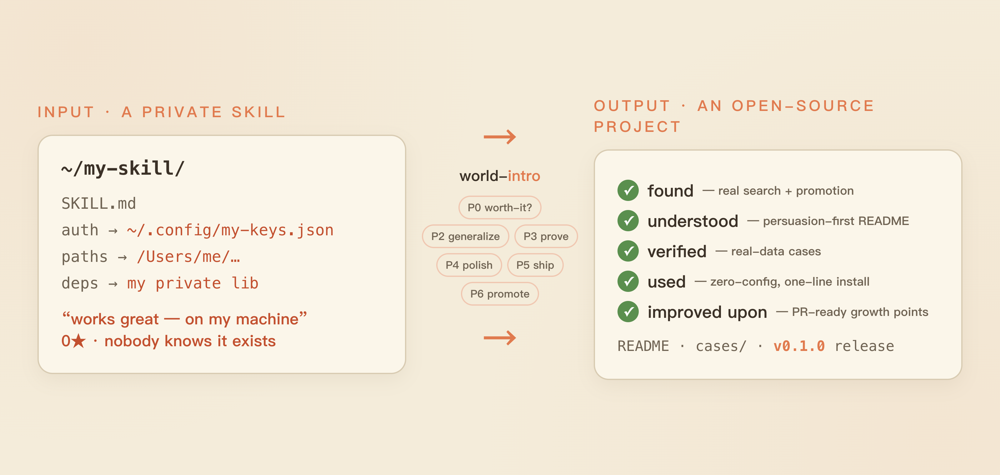
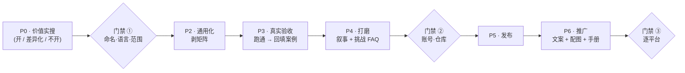

# world-intro

<p align="center">
  
</p>

[English →](./README.md)

**先判断它值不值得开源，再把你的私有 skill 介绍给世界——让它被找到、被理解、被检验、被使用、被改进。**

world-intro 是一条带门禁的端到端管线，把"我自己用着很好"变成"陌生人也想用"。它不只是替你写个 README——它先告诉你**该不该开源**，把工具从你自己的机器里**通用化**出来，用**真实数据**跑出可信案例（这些数据直接变成 README 的案例），按反 AI 味规则**打磨叙事**，发布它，再在各平台**推广**让它真正被看见。

<p align="center">
  
</p>

## 是不是很熟悉？

### 「我天天用的一个 skill——它到底值不值得开源？」
> 原计划：推上 GitHub 然后碰运气。多数工具就是这么拿到 0 star 的——旁边早有个项目做得更好。
**它做什么**：P0 先真实搜一遍这片赛道，给三态判决之一——空白赛道（赶紧开）、拥挤但无主导者（开，但 README 里写明你的差异）、已被占领（**别开**，去给上游提 PR）。搜索说该开，你才动手。

### 「我的工具和我的机器绑死了——我的路径、我的 key、我的私有库。」
> 原计划：把文件夹拷进公开仓库，然后花一个周末删东西，删到不再漏密钥为止。
**它做什么**：P2 剥掉个人矩阵——把私有库内联进单文件零依赖、把鉴权改成可选标准环境变量、把付费源做成可选且默认零配置可用——并留出注释邀请 PR 的社区生长点。

### 「我推上去了，但没人来。」
> 原计划：发一条推贴链接，然后刷 star 数。
**它做什么**：P6 把卖点收窄成一句话，写各平台适配文案并过一遍去味，产出真实的**实证图**（HTML 渲染，仓库名和数字不糊），再给每个平台配一份发布编排手册。

这些不是假设——它们是[这条管线真实推出去的两个项目](#用本管线真实跑出的开源项目)。

## 三步用起来

```bash
# 1. 安装（以 Claude Code 为例；其它 agent 把 SKILL.md 加进 system prompt）
git clone https://github.com/a28939876-max/world-intro
cp -r world-intro ~/.claude/skills/world-intro
```

```
2. 跟你的 agent 说：
   "帮我把这个 skill 开源：<你的工具路径或描述>"
```

```
3. 回答三个门禁问题（名字 / 语言 / 拿哪个真实对象来验证），
   再走完 判决 → 通用化 → 验证 → 打磨 → 发布 → 推广 这条管线。
```

## 没有它 vs 有了它

| | 没有 world-intro | 有了 world-intro |
|---|---|---|
| 该不该开源 | 凭感觉 | 真实竞品搜索给出的三态判决 |
| 怎么变公开 | 手动删密钥删到不漏为止 | 剥矩阵成零配置单文件 |
| 可信度 | "信我，它能用" | README 案例是真实运行的真实数字 |
| README | 一张功能清单 | 说服力前置：需求→结果、大白话、短板进 FAQ |
| 推完之后 | 0 star，发一条推 | 收窄的卖点 + 各平台文案与配图 + 编排手册 |
| 门禁 | 没有——漏了/推错了事后才知道 | 三道人工门禁：方案 / 发布 / 推广 |

## 我们拿它开过自己的刀

world-intro 不是凭空来的。它是两个真实发布背后的提炼管线——[skill-lineage](https://github.com/a28939876-max/skill-lineage) 和 [world-aid](https://github.com/a28939876-max/world-aid)——**这里的每条规律都在那两次发布里付过学费。** 然后它被指向了自己：你正在读的这份判决、下面的案例、这份 README 本身，都是用 world-intro 跑 world-intro 跑出来的。

## 这条管线



skill 本体是 [SKILL.md](SKILL.md)；深度内容在 [pipeline/](pipeline/)——[打磨规律](pipeline/polish-rules.md)、[推广手册](pipeline/promotion-playbook.md)、[发布坑](pipeline/publish-pitfalls.md)。

## 用本管线真实跑出的开源项目

从 world-intro 推过的发布里挑的典型——完整写法在 [cases/](cases/)：

| 案例 | 那个工具 | 它验收时跑出的一个真实结果 |
|---|---|---|
| [01 · skill-lineage](cases/01-skill-lineage.md) | 装之前先查一个 skill 的 fork/镜像/注入 | 翻出一个按星排序会藏起来的 **5,233★** 汉化版；一次 diff 抓到一条"偷偷打分回传"的注入 |
| [02 · world-aid](cases/02-world-aid.md) | 说一句需求，它把现成工具找齐 | "油管→文字"：**13 候选 → 9 个真正不同**；最唬人的 7★ "Tor" 版被抓到在 `sudo systemctl start tor` |

## 和「代码硬化」类 skill 有什么区别？

[open-source-hardening-skills](https://github.com/zeyuzhangzyz/open-source-hardening-skills) 这类 skill 把你的**代码**弄干净——测试、CI、重构、治理文档。world-intro 管的是它**前面和后面**：值不值得开源、怎么从你的环境里通用化、怎么把真实结果变成让人想用的叙事、上线后怎么被看见。两者是上下游互补——一起用。

## FAQ

**「这是方法论 skill，不是带二进制的硬工具——价值在哪？」**
价值就是那些在真实发布里付过学费的规律：矩阵剥离表、反 slop 清单、"实证图必须 HTML 渲染、不能文生图"、三道门禁。它故意是有主张的——多数开源发布建议都是给人读的文章、且默认你已经决定要开；这条会先搜索，并且会告诉你**不要**开。

**「官方/头部项目会不会直接把我这块吃掉？」**
如果 P0 判定赛道已被占，那正是正确结局——world-intro 让你去给上游提 PR，而不是再发一个冗余仓库。当它说该开，它会让你在 README 里写明差异，让"被收编"成为一场公平竞争而不是冷不防。

**「真的只有两个案例吗？」**
不是——这两个是管线跑过的发布里挑的典型；规律适用于任何私有 skill 或内部工具，不止这两个。

## 许可证

MIT——见 [LICENSE](LICENSE)。
